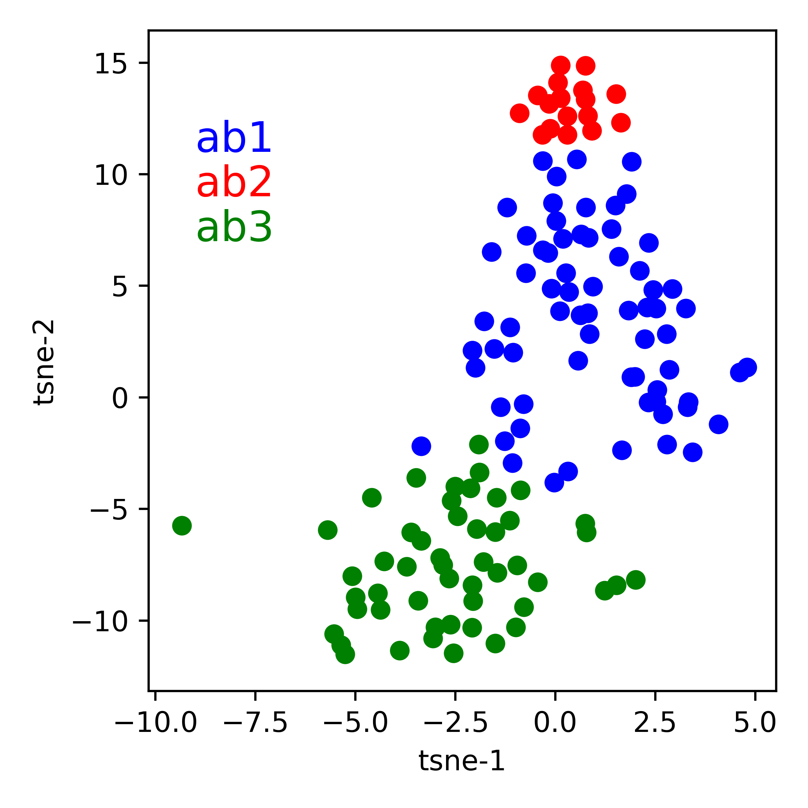

# tsetse-odor-coding-analysis

This code analyzes the statistical relationships between different classes of olfactory receptor neurons in the sensing hairs (sensilla) of tsetse flies. The analyses here was used in the publication ["Odor coding in the antenna of the tsetse fly *Glossina morsitans*"](https://www.pnas.org/content/116/28/14300.full) by N. Soni, S. Chahda, and J. Carlson, published in May 2019 in *PNAS*.

